# PegasOS - System

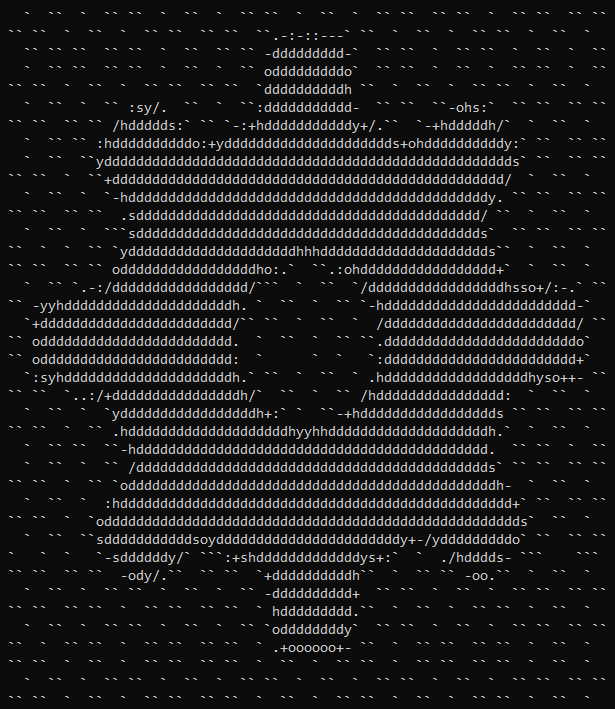

# 5.1 System Directories

## 5.1.1 PegasOS Root Directory

PegasOS will follow the general layout of the Linux systems, with the system’s core at the lowest possible root of the file system and additional directories stemming from there. The system will have a minimal root directory that will contain all of the system’s files necessary for operation. Included in this is a directory for users of the system, which will allow for multiple users to have their own ‘desktops’ and files that will be accessible only by them and the system admin or system master.

The root directory of PegasOS will only be able to be modified by the kernel itself - which should not be modifying the structure of the directories - or by the system master. Because the system master will be able to modify this root directory, it is possible that the directory can be tampered with in such a way that the system will no longer be able to function correctly. Should this happen, the system will need to be reinstalled.

The purpose of the root directory is to keep all system-related data as close to the system as possible, which means it will be at the lowest level of the system such that it does not interfere with the user’s use of the system, nor can it be accessed by the average user who uses the system. In this way, the workings of the system are protected from accidental tampering, however, it is still accessible to those who wish to have access to it with the caveat that only the system master can modify the root directory. Normal users may still see what files are in these directories.

The structure and contents of the root directory may change over time, however, the aim is to keep the root directory simplistic such that it only contains what is necessary. This will allow us to keep the system’s usage of memory to a minimum, and allow the user to use as much remaining space on the SD card as possible. As an added bonus, the less memory that the system takes up, the more it can fit into RAM to keep the system as fast as possible.

## 5.1.2 PegasOS Root Directory Overview

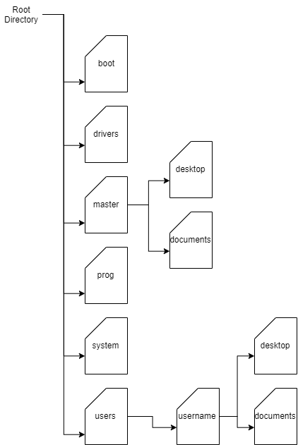

<dl>
<dt>Boot</dt>
<dd>This directory will contain all of the necessary files for boot-up, apart from those contained within the EEPROM already on the Raspberry Pi. This will primarily be made up of .elf files that set up the rest of the system for operation. This directory may contain other files or information related to the boot-up of the system.</dd>

<dt>Drivers</dt>
<dd>This directory will contain any hardware drivers that the system will use to interact with various pieces of hardware, such as keyboards, speakers, monitors, etc.</dd>

<dt>Master</dt>
<dd>This is the admin or system master’s directory, which will reflect that of a typical user’s directories. The key difference is that the system master will be able to add, modify, and remove files from any location on the system - essentially giving them kernel-level access, much like Linux’s root user.</dd>

<dt>Prog</dt>
<dd>This directory will contain all binaries for programs that can be executed by the system shell.</dd>

<dt>Users</dt>
<dd>This directory will contain a sub-directory for every user that is using the system. Each user directory will contain its own ‘documents’ and ‘desktop’ directories, to offer the users some built-in categorization should they choose to use it. While there is no graphical interface, the ‘desktop’ directory would be equivalent to the directory that is displayed on the main screen of the operating system.</dd>

<dt>System</dt>
<dd>This directory will contain all binaries and data for system programs, calls, and services. Respectively, the binaries will be contained within the ‘bin’ subdirectory and all data will be contained within the ‘data’ subdirectory. Within the ‘data’ subdirectory, there will be three further subdirectories that further categorize the data contained within. The ‘users’ subdirectory will contain a user registry file for every user registered with the system. The ‘log’ subdirectory will contain all system logs and information that the system may need to refer to or record. The ‘locale’ subdirectory will contain all system localization files needed for translations of system dialogue.</dd>
</dl>

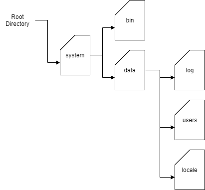

# 5.2 System Set-Up

When the system is initially installed, some basic actions will need to be performed in order to set up the system for the first time. This section will detail each step of the initial set up, and what each step impacts on the system itself.

## 5.2.1 System Language

First, the user will need to choose what language they wish to perform set-up in, as well as what language they wish for the operating system to be installed with. For the first release of this software, there is no guarantee that there will be translations aside from the primary English translation. If you would like to contribute a translation of your own to the project, please see the System Localization section for more information on how our localization files are formatted.

## 5.2.2 System Location

The user may choose to enter the country they are residing in, though this will not be a mandatory field. In future releases of the system, if the system has internet connectivity then this setting may be overridden by data provided through the internet connection.

## 5.2.3 System Keyboard Layout

This is included for the sake of completeness, though for the initial release of the system this will most likely not be customizable. Initially, the system will be using ASCII as the primary character set. For future releases of the system, we plan on supporting both ASCII and Unicode Standards. For more information on ASCII or Unicode, please follow the respective links:

> http://www.asciitable.com/
> 
> http://unicode.org/standard/standard.html

This will ensure that the system can be used by a wide variety of users, despite a lack of international support in the early life of the system. We will do our best to accommodate all keyboards and character sets, however, this is secondary to making sure that the system functions on its initial release. For this reason, we will be guaranteeing that the system will work with ASCII by default, and at a bare minimum. As more character sets are supported by the system, these options will become available to the user and the information here will be updated to reflect these changes. The first Unicode character set that will be supported will most likely be en_us.utf-8.

## 5.2.4 System Date and Time

Next, the user will need to choose their date and time zone to set their system clock appropriately. The system will automatically account for Daylight Savings Time, based on the date entered in this field. In the future, if the system has internet connectivity then these settings will be overridden by data provided through the internet connection. The correct date and time settings are important for logging information generated by system diagnostics and testing, as well as for additional information to include file creation, modification, and where necessary, deletion.

## 5.2.5 Master Password

Next, the user will need to provide a new password for the master user on the computer. By default, the master password is ‘pass’ for simplicity. Obviously, this is not a strong password so we recommend that the primary user of the system change the master password to something more secure. Please see our password guidelines if you would like tips on creating a strong password.

## 5.2.6 Create New User

Finally, the user installing the system will create a new user registry entry of their choosing. This user registry will ideally be for the primary user of the system. During the set-up of this registry, the user will be able to enable master permissions for that user account. For more information on this process, please read the *Log-In Menu* subsection in the User Subsystem section.

# 5.3 System Localization

While PegasOS is at its basic level a student operating systems project, there is still potential for the operating system to be used by a much wider audience than what is anticipated. For this reason, we will be including international localization support to the best of our ability. Localization is an inherently difficult task, as it requires careful future-proofing of the system so that it is not rewritten every time an additional language is added to the system’s repertoire, as well as correct translations such that users understand what the system is asking of them.

## 5.3.1 International Localization

By localization, we, of course, mean that PegasOS will support the ability to be translated into many different languages in an effort to make the system as usable as possible for all users. These translations will be stored into various localization files in the system directory, and the appropriate translations will be displayed based on the user’s language settings. We are not language experts, nor are we ignorant of the fact that the task of translating the system will get more difficult as the system expands and more system dialogue is added.

For this reason, we are not expecting to have fully-realized translations for the initial release of the system, apart from the default English translation. Despite this, we are optimistic that through future-proofing our localization system, future translations of the system will be relatively seamless in their installation. If you would like to contribute towards localization of PegasOS, you may apply to be a contributor to the project on GitHub, and submit your localization file there.

## 5.3.2 Localization File Standards

Localization files will be contained in a separate directory (as specified in the *System Directory* section), wherein the appropriate file will be read from when menu dialogue must be printed to the screen. To ensure that all localization files can be read by future versions of PegasOS, we will establish a file standard that all localization files must follow in order to be read successfully by the system.

The system will follow the guidelines as described in the following diagram. Please note that the code displayed is an approximation of what will be in the final system.

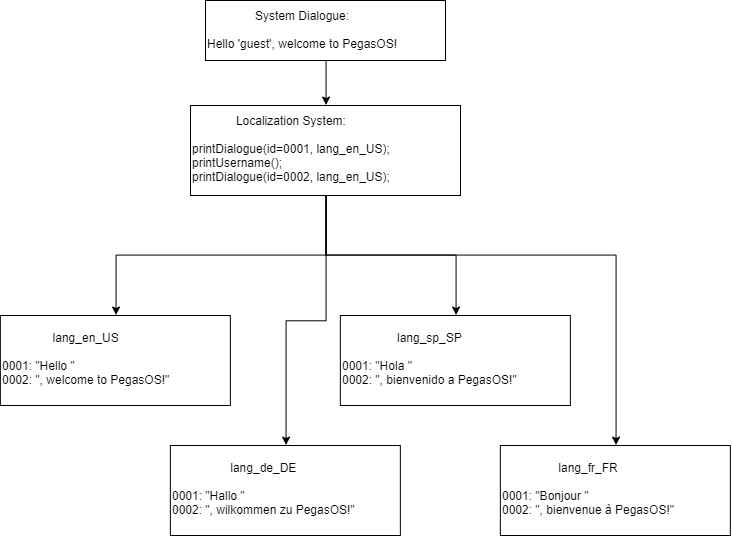

## 5.3.3 Loading Translated Text

With this file formatting, it will make loading the actual text for display in the system extremely easy. We will perform a simple lookup in the appropriate file based on the language the user has chosen and read in the string according to the dialogueID. After this string has been read in, we simply print it to the screen. The most complicated part will be ensuring that no dialgoueIDs are reused between entries in the localization files, however, this should be simple if the main English translation has already been completed.

An important note about PegasOS and displaying text in other languages is that the system will be supporting ASCII initially, with plans to expand into Unicode at a later date. This may affect how localizations are displayed in the system until this problem can be addressed and Unicode is fully supported.

## 5.3.4 Localization Support

Through our localization system and future-proofing of the system, we hope to support as many translations of the system as possible. To do this, any translations that are submitted need to be checked to ensure that the translation is as accurate as possible to the original English that the system dialogue is written in. As a small team, it will take time to check the work of new localizations that are not made ‘in-house’, and as such we ask for your patience when reviewing ‘out-of-house’ localization files.

# 5.4 System Users

PegasOS will allow for multiple users to be registered at once, granting them unique directories to store their data for general use. Each user is given a ‘desktop’ directory and a ‘documents’ directory, as well as permission to create and remove subdirectories within their user-space. Users will be allowed to use most programs on the system, except those reserved for system-level use. The user will be able to execute these programs and commands through the terminal shell. The list of minimum user functions includes:

- Open and Close Files
- Create and Destroy Files
- Create and Destroy Directories
- Execute Shell Programs
- Read System Diagnostics

By default, the ‘guest’ user will be signed in if no users have set up the system. At a minimum, there will always be the ‘master’ user and the ‘guest’ user on the system.

## 5.4.1 User Registry File

User data will be contained within a registry file, which will be formatted as follows:

These files are read-only in most circumstances. If the user wishes to change their username, they must first confirm with their password that they wish to change their username, which will allow them to change the username hash by entering in their new desired username. The password is changed in the same way, however, the hash is salted. The values ‘usercolor’ and ‘dircolor’ can be changed through the user’s Details menu, and do not require a password re-entry. The super-user flag, ‘superP’ can only be changed with the master’s permission, which requires a master’s password to grant.

## 5.4.2 Usernames

Usernames are tags that associate a registry file and specific info to a specific user. They are typically memorable names that a user has associated with themselves, and is used to log-in to a service or computer. PegasOS allows users to choose a username of their own choosing and is not tied to their real name unless they choose to. Usernames may be no longer than 24 characters. This limit may be increased at a later date and is mainly set for storage reasons. Apart from the length of the username, no other limits are placed upon the username of the user. This means that we do not filter the usernames by appropriate language, phrases, or symbols, and leave that up to the discretion of the user.

5.4.3 Username Storage

User’s usernames are stored on the machine in the user registry file as a 256-bit hash, as an array of 32 chars with position 0 of the array representing the highest 8 bits of the hash. This is to ensure extra security for the user and to help prevent cracking passwords associated with specific usernames.

## 5.4.4 User Passwords

User passwords are what allow the user to identify themselves as the correct user of an account. Passwords may be no longer than 64 characters. This limit may be increased at a later date and is mainly set for storage reasons. Apart from the length of the password, no other limits are placed upon the password of the user. However, we do suggest that you use the following guidelines to create a secure password.

1. Use spaces in your password.

This is not always allowed for various reasons, however, it greatly increases the security of your password. For one, if you choose a password with a number of words, the spaces can clearly separate the words which make it easier to remember. Consider the following:

> mysecurepassword
> my secure password

This also increases the total length of your password, making it harder to crack. You may also choose to do something like the following:

> my sec ure passwor d

By inserting random spaces into the password, it further jumbles it up, making it harder to crack. Be warned though, that making too many small sections within the password may introduce vulnerabilities in cracking algorithms that consider spaces. There is a fine balance between too many spaces and the right amount.

2. Use odd symbols in your password.

Perhaps the most commonly used symbols for most uses are ‘!’, ‘@’, ‘#’, and ‘?’. While this will increase the security of your password by expanding it past basic numbers and letters, using these in place of normal letters is not ideal.

> p@ssword

It is better to instead add less-frequently used symbols, or instead of swapping out letters for symbols to simply add the symbols to the word or phrase.

> pa@ssword

It is *trivial* to make a program that simply swaps out letters in words for similar-looking symbols. At the very least, changing it to be a less-frequently used symbol will get past lesser programs, and take longer in others.

3. Don’t only replace letters with similar-looking numbers.

Everyone has seen passwords that look like the following:

> Passw0rd

These types of passwords are trivial to crack on their own. It is much more secure to simply insert numbers between letters rather than replacing letters with similar numbers. Consider the following:

> passwor9d 12

This is much more secure than simply swapping letters with numbers.

4. Keep the length of your password to a minimum of 16 characters.

While PegasOS does support a password of any length up to 64 characters (you may even use no password for a user, such as with the guest user), to increase the security of your account we suggest using at least 16 characters in your password. This greatly increases the amount of time needed to crack the given password, at a minimal cost of remembering a longer password.

5. Do NOT use common words.

If nothing is taken away from these guidelines, please at least take this away.

If you use ‘password123’ as your password, your account has been compromised. Full stop. Do not use password in your password. Do not use your username in your password (at the very least, modify your username if you’re using it as your password too). Do not use common phrases, such as ‘iloveyou’ or ‘breakaleg’. Do not use the name of the program you are using, such as ‘adobe123’ or ‘photoshop’.

6. Use multiple, unrelated words.

This is the easiest way to make your password more secure, without having to do anything special. Consider the following:

> chicken trash blanket

These words are unrelated, yet make a memorable phrase that sticks out in the mind. In addition to this, it’s 21 characters long! That’s more than enough to make it secure in most brute-force cracking algorithms. And in a dictionary attack or otherwise more sophisticated cracking algorithm, due to the words being unrelated it will take much longer than a phrase like the following:

> chicken wing grill time

If you’d like to test out some sample passwords according to these guidelines, check out the following website:

https://howsecureismypassword.net/

Obviously, ***don’t enter your real passwords*** into this site. While they do say that passwords entered into the website are not stored and sent out on the internet, you can never be too careful.

## 5.4.5 User Password Storage

Of course, a password is only as secure as how it is stored. For this reason, PegasOS will store user passwords on the machine as a salted and hashed password.

For the sake of transparency, this process will be as follows:

1. Salt is applied to the password

This salt will come from the username, which will allow for users to choose the same password and result in different hashes for the password, keeping both users more secure and accounting for edge cases in which multiple users unknowingly pick the same password.

2. The password is sent into a hashing algorithm.

After the salt is applied to the password, it is bundled up and sent into a one-way hashing algorithm.

3. The resulting hash value is stored in the user’s registry file.

The hash will be stored as a 256-bit hash, as an array of 32 chars, where position 0 in the char array represents the highest 8 bits of the hash.

## 5.4.6 User Permissions

Depending on the ‘type’ of user permissions that the user has, certain actions within PegasOS cannot be performed. User permissions can be of two types: system administrator (master) or standard. Master users may make any changes to the system as they see fit, much like a root user or sudoer can in Linux. Standard users cannot make these changes, but with the master account’s permission they may upgrade their permissions to that of a master user.

The main difference is that master users have full control over the system, and are able to create files and directories wherever they please. They are also allowed to modify, and remove files and directories wherever they please. **This means that great care must be taken when working in the root directory of the system, as it is possible to irreversibly damage the system.** For the average user, this will not be a concern, as most system files that the average user can access are read-only, or otherwise untouchable.

Full control over the system includes functions such as, but not limited to:

- Changing the system clock
- Terminating system processes
- Modifying the system directory (root)
- Modifying system binaries
- Changing user settings
- Deleting and creating users
- Viewing system logs

# 5.5 User Subsystem

The user subsystem is the system which handles user log-in, creation, deletion, and handles the display and changing of user info. The following describes the various menus within the PegasOS User subsystem, which is made up of two key systems. The first of these being the log-in system, which allows existing users to log-in as well as allow new users to create a new user account. This log-in system also allows the user to see a list of currently enrolled users on the system. The second being the user-menu system, which allows the logged-in user to adjust some of their account settings, preferences, and permissions. This section will also serve as a guide to how to use these systems, and detail all of the sub-menus within both services.

The system will have no hard limit on the number of users on that particular install, however if a user account is no longer needed, please be sure to remove that user account. As each user account is stored in a separate user registry file, and a new subdirectory is created for each user, this can quickly add up in the amount of space used on the SD Card, restricting space for other uses of the system.

Since user accounts are the primary method in which the system is interacted with, it is necessary for there to at least be one user account on the system at all times. While the master account can perform almost any operation on the system, they will not be allowed to remove themselves from the system. In addition to this, every system install will come with two premade user accounts, those being the ‘guest’ account and the aforementioned ‘master’ account. This will make logging in to the system easy for quick system setup and modification, and also allow for non-permanent users of the system to still use the system and be able to access all of the system’s features.

While the majority of the user’s functionality is used through the system’s Shell component and the included programs - creating users, switching users, and logging users in and out is done through the aforementioned log-in and user menus.

## 5.5.1 Log-In Menu

To access the log-in subsystem, use the ‘login’ command in the shell. This will bring up the following menu.

From here, the user presses the key indicated in the brackets to access the corresponding menu option. The selection does not need to be capitalized, only the key needs to be pressed. If an invalid selection is given, the following prompt will be displayed and the menu will return.

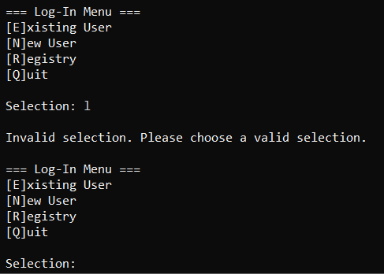

Existing User:

To log-in as an existing user, press the ‘E’ key which will then bring up the following prompt.

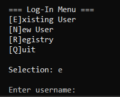

If the username entered does not match a user account currently in the registry, the following prompt will appear. Otherwise, the system will continue and ask for that user’s password.

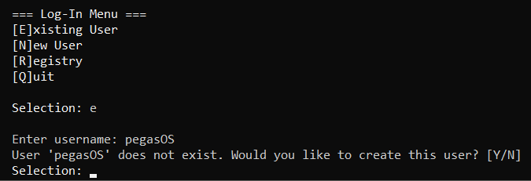

If ‘Y’ or ‘yes’ is selected, then the user will be directed through the same prompts as the New User command (see New User for more information). If ‘N’ or ‘no’ is selected, then the user will be returned to the Log-In Menu with the previous user being logged in.

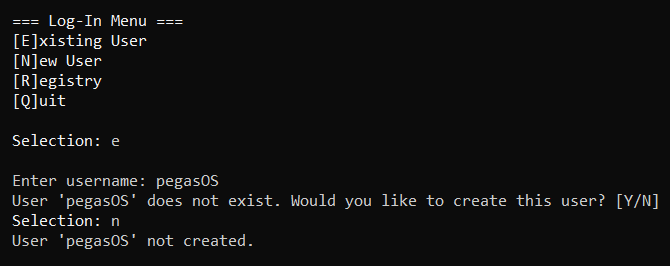

If the username entered matches a user account in the registry, then the following prompt will appear.

Upon the password being entered, it will be checked alongside the system’s copy of the user’s password. If there is a match, then the user will be logged in and the following confirmation will be displayed. Then the User Menu will be displayed.

If the password does not match, the following error will be displayed. After pressing any key, the user will return to the Log-In Menu.

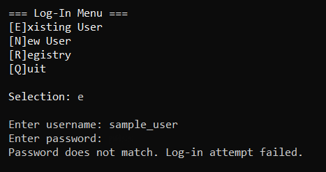

New User:

To create a new user, press the ‘N’ key which will then bring up the following prompt.

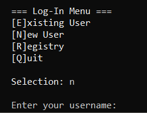

Upon entering the username, the following prompts will appear.

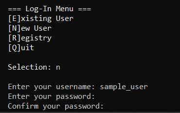

If the password entered between the two password prompts does not match, the following error will be displayed.

If ‘Y’ or ‘yes’ is selected, then the user will be given an additional attempt to create their password. If this attempt is failed as well, the user will not be created and they will return to the log-in screen.

If ‘N’ or ‘no’ is selected, then the user will return to the Log-In Menu.

If the password entered between the two password prompts does match, the following confirmation will be displayed, the system’s user registry file will be updated, and the user will be logged in.

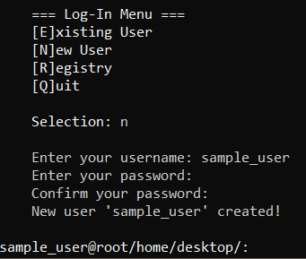

Registry:

To view the list of currently registered users, press the ‘R’ key and the system will print out the list of all users in the system. At a minimum this will consist of the system master and a guest user.

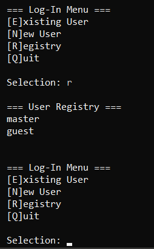

Quit:

To return to the terminal shell, press the ‘Q’ key and the system will terminate the Log-In subsystem. If no user was logged in, then the system will power down.

## 5.5.2 User Menu

To access the user menu subsystem, enter “user” from the shell and the following menu will appear.

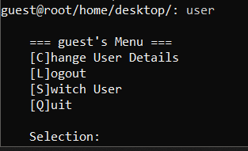

**Change User Details:**

To change the user’s details, press the ‘C’ key and the following sub-menu will open.

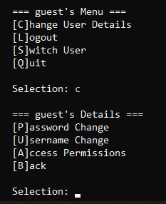

Selecting ‘P’ or ‘U’ for either Password Change or Username Change respectively will require the user to re-enter their password to confirm it is a change they wish to make.

[Image Goes Here]()

Note: Passwords will NOT be shown as they are typed.

After their password has been confirmed, if the user selects to change their password, the following prompt will appear.

[Image Goes Here]()

Upon entering the new password and confirming the new password by re-entering it, the registry file will be updated to reflect the new password, and the following confirmation will be printed to the screen.

If the user selects to change their username, the following prompts will appear.

[Image Goes Here]()

The user will be required to enter the new username and confirm it. Once the username has been confirmed, the user’s username will be set to the new username, and a confirmation message will be printed to the screen.

If the username does not match between confirmations, the username will not be set and the user will be returned to the User Details menu.

[Image Goes Here]()

If the new password does not match between entries, an error will be reported to the user and they will be returned to the User Details menu.

[Image Goes Here]()

If the ‘A’ key is pressed for Access Permissions, the user will be required to enter the system master’s password.

[Image Goes Here]()

If entered correctly, the user will be able to elevate their privilege access to system-level through the following sub-menu. A ‘\*’ will indicate which level of permissions the user currently has.

[Image Goes Here]()

Upon pressing the ‘S’ key for System Level Permissions, the following prompt will appear. Upon confirmation that the user understands the risks, they will be granted the same privileges as that of the system master. They will then be returned to the Permissions Menu.

[Image Goes Here]()

[Image Goes Here]()

Pressing the ‘B’ key will return the user to the User Details Menu.

<ins>Logout:</ins>

Pressing the ‘L’ key to select Logout will log the current user out of the system. This will display the following prompt, and return the user to the Shell as the system ‘guest’ user.

[Image Goes Here]()

<ins>Switch User:</ins>

Pressing the ‘S’ key to select Switch User will allow the current user to log-out then immediately sign-in a new user. This process is the same as the ‘Existing User’ command for the Log-In Menu. For more information on this process, please view the guide on using the Log-In Menu.

[Image Goes Here]()

<ins>Quit:</ins>

Pressing the ‘Q’ key to select Quit will return the user to the terminal shell. This will not logout the user.

[Image Goes Here]()

# 5.6 System Calls

There are several system calls that PegasOS allows processes to use, which are compiled here for your convenience. These calls are split up into categories and organized alphabetically to make their function and usage easily identified, so that if modification of the system is necessary or a user wishes to make programs for the system, they understand what system calls will be best suited to the task. This list may be updated and revised as the need for additional system calls is met and dealt with.

## 5.6.1 System Diagnostics

`*For the time being PegasOS will only support one clock, that being the
hardware’s clock.`

`int get_clocktime()`

Returns the system’s internal clock time in milliseconds.

`int set_clocktime(int milliseconds)`

Sets the system’s internal clock time to start at the given number of milliseconds. Returns 0 if successful, -1 if permission was not granted to change the clock.

`int set_clockzone()`

Changes the system clock’s time zone. Returns 0 if successful, -1 if permission was not granted to change the clock timezone.

## 5.6.2 Process Creation and Deletion

`int p_clone(), p_clone(0), p_clone(1), p_clone(2)`

It creates an identical copy to the current process as a child process. The child process uses the same data as the calling process. If no argument is given or if ‘0’ is passed as the argument, the calling process will resume execution upon the child process’ termination. If ‘1’ is passed as the argument, the calling process is terminated and the child process takes over. If ‘2’ is passed as the argument, the calling process is terminated and all memory associated with the process is freed. Returns 0 if the child process was created successfully and has terminated, -1 if the child process could not be created.

`int p_destroy()`

Immediately terminates the calling process, freeing all memory associated with it. Returns 0 if all memory is freed successfully, -1 if some of the memory could not be freed.

`int p_wait(int m)`

Suspends the current process for ‘m’ milliseconds, after which the process resumes execution. Returns 0 after the timer has ended.

## 5.6.3 Process Information

`int get_p_class()`

Returns the current process’ class as an integer, as defined by the following scale.

| Type | Description         |
| ---- | ------------------- |
| 0    | System Process      |
| 1    | Interactive Process |
| 2    | Foreground Process  |
| 3    | Background Process  |

`int get_p_id()`

Returns the calling process’ id, as kept in the Process Control Block for that instance.

`char[] get_p_name()`

Returns the process’ string identifier in the Process Control Block. This is primarily used for displaying the current processes in the Scheduler. If no name or an empty string is kept in the Process Control Block, then the process id is returned preceded by “P#” will be returned instead. For example: “P#24601”

`int get_p_priority()`

Returns the process’s priority level as an integer. The following scale determines its priority.

| Priority Level | Description                       |
| -------------- | --------------------------------- |
| 0              | Highest Priority, System Priority |
| 1              | High Priority                     |
| 2              | Medium-High Priority              |
| 3              | Medium Priority                   |
| 4              | Medium-Low Priority               |
| 5              | Low Priority                      |
| 6              | Lowest Priority                   |

`int get_p_uptime()`

Returns the combined heuristic of the process’ elapsed execution time and the process’ elapsed wait time.

`int set_p_id(int id)`

Changes the process’ id to that specified in the argument, granted the requested id is not being used by another process. Returns 0 if successful, -1 if unsuccessful.

`int set_p_priority(int p)`

Sets the current process’ priority according to the argument ‘p’. Priority ‘0’ can only be requested by system services. Returns 0 if successful, -1 if unsuccessful.

## 5.6.4 File Manipulation

[Image Goes Here]()

`int close(int fileId)`

Closes the file associated with the file id in the calling process. This also frees the file descriptor associated with the given file.

`int open(char const *path, int flags)`

Opens or creates the file at the designated path. The flags specify what permissions the file will be given upon being opened or created. Upon success, a file descriptor is created for the process and the file descriptor id is returned. Returns -1 if the file could not be opened or created.

| Flags Key       |
| --------------- |
| 0 - Read Only   |
| 1 - Write Only  |
| 2 - Read, Write |

`int read(int fileId, void *buffer, int count)`

Reads a number of bytes specified by ‘count’ into the data buffer ‘buffer’ from the file associated with the given file id and the calling process. The file must have been opened with read permissions. Returns 0 if successful, -1 if unsuccessful.

`int write(int fileId, void *buffer, int count)`

Writes a number of bytes specified by ‘count’ from the data buffer ‘buffer’ into the file associated with the given file id and the calling process. The file must have been opened with write permissions. Returns 0 if successful, -1 if unsuccessful.

`int print(void *buffer, int count)`

Writes a number of characters from the specified address to the screen.

# 5.7 Implementation of System Calls

Before going into full detail on how all the system calls will be executed, we will talk about a Table we’ll be using that is similar to one used in the Linux operating system. In the Linux operating system when a system call is initiated and then sent off to be executed, the assembler will create the corresponding assembly code and will then have to reference that given command through an integer value. That value will represent the level of priority for the interrupt. We have looked at tables for reference and have narrowed down the list to put the information we’ll need to use to implement the initial design of PegasOS. As this being the initial design for PegasOS, there is a high chance there will be more in the table in the final release for PegasOS.

| Syscall Name   | Value |
| -------------- | ----- |
| get_clocktime  | 1     |
| set_clocktime  | 2     |
| set_clockzone  | 3     |
| p_clone        | 4     |
| p_destroy      | 5     |
| p_wait         | 6     |
| get_p_class    | 7     |
| get_p_id       | 8     |
| get_p_name     | 9     |
| get_p_priority | 10    |
| get_p_uptime   | 11    |
| set_p_id       | 12    |
| set_p_priority | 13    |
| close          | 14    |
| open           | 15    |
| read           | 16    |
| write          | 17    |
| print          | 18    |

So with the table above, the assembler will use these values to distinguish the separate commands by storing the value into the register which represents the corresponding command being executed. As mentioned above, these are only for the syscall commands we have right now. There will be more commands added for needed functionality when we implement them into the operating system. Below will be an example of how we will execute system call functions. The examples below are samples of the Linus 0x80 systems, we will be implementing it in a similar fashion.

[Image Goes Here]()

The program demonstrated above is a sample code of System Calls for a simple Hello World print to the screen program. The write command is given the proper parameters where the 1 signifies that it will be written to stdout. The string in the middle is what will be written to the screen, and 12 is the number of bytes to be written from the string given. The exit system call command simply is used to signify that the program has ended and the 0 is simply the return value.

[Image Goes Here]()

When the assembler begins to generate the code needed for the given system call code, it will create a string variable to hold the string given as a parameter. It also creates the starting variable name of `“_start”` where the assembly code begins.

[Image Goes Here]()

The last part of this example is the generated assembly code that will be executed by the CPU. One can see that we are storing the integer value corresponding to the command we are executing in the %eax register and the other parameters stored in their respective registers. Once these are done, it is then executed since the command ‘int $0x80’ is encountered. When completed, it moves onto performing the assembly code for `“_exit(0)”`.

We will be implementing our system calls very similar to this format and the same with the accompanying assembly code to perform the commands.

[Back - Hardware](4_HARDWARE.md) | [Next - Kernel](6_KERNEL.md) | 
[Design Document Home](DESIGN_DOCUMENT.md) | [Documentation Home](../README.md)