# PegasOS - Shell

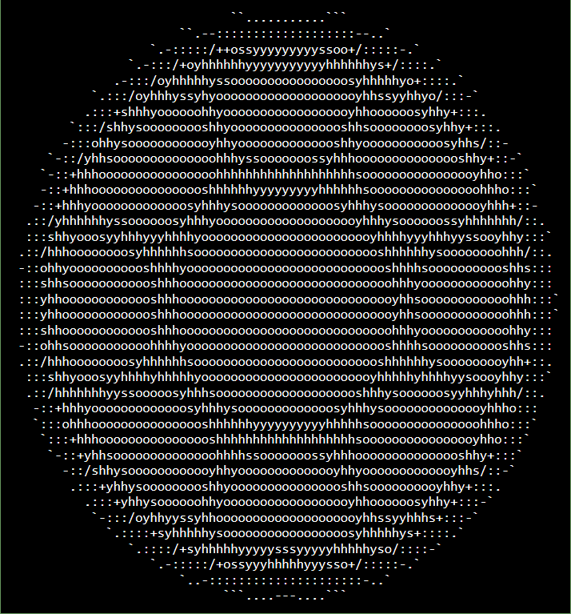

7.1 Shell Background Research
7.1.1 What is a Shell?
        A Shell is a program that interprets commands from the user and turns them into functions that the operating system can understand. Every operating system today has some variation of a shell program that while not used as often today, still grants the user a degree of control over the system that the new GUI-based operations don’t always allow. And in the olden days of operating systems, this was the only way to interact with the computer itself which was already a step up from what there was previously - which was nothing.


Shells are text-based interfaces, which use the keyboard for input and display text to the screen. Typically they use ASCII and Unicode characters, and occasionally have support for various text fonts. Modern shell programs will also include various hotkeys and controls involving the mouse but are still completely operable with only the keyboard.


Since shell programs are an interpreter between the user and the operating system, it occupies a space somewhere between user programs and the kernel itself. Due to the nature of the shell’s translation, it can also be implemented into the kernel directly and act as the user’s access port into the operating system and by extension, the kernel itself (given the appropriate permissions).


        To ensure that PegasOS is an operating system that the user can interact with, we will be using a shell program to take in user input.


7.1.2 Graphical User Interface (GUI)
        From Windows to macOS and Linux all three of these dominant operating systems are built and optimized to where the user, new or old, can pick-up and use due to the great Graphical User Interface made for user interaction. The GUI is such an important aspect of a successful OS since it’s how the user interacts with the computer itself, and it is much less complex and daunting than the traditional command line. With GUI-based operating systems the user primarily uses the keyboard and the mouse to interact with different elements, typically called windows, displayed to them. The operating system, in this case, is in an infinite loop waiting for the next input from the user to do a new action. Now creating a working and well-polished GUI is no easy feat, as not only must it work programmable, but it must be visually appealing as well as visually intuitive to the user. Creating a working GUI is almost as much work as making the operating system that the GUI interacts with.

7.1.3 Command Line Interface (CLI)
Before the common GUI was created, the standard platform for navigating through a computer’s operating system was the Command Line Interface. The CLI was simply a window where the user would input commands and certain arguments for the command in which the operating system would search through its library for the command given. This approach had a very steep learning curve since the user had to memorize all the commands and the certain arguments for said commands to change how the command will be executed. Although the steep learning curve was a hassle for the users, it was greatly liked for how direct the user could be with the machine. The main usage for this method was not for the ease of the user, but more for handling and executing more programs in a shorter time than previously designed computers. So this is why the CLI was very bare compared to a common day GUI.


7.1.4 PegasOS Interface

Because creating a GUI for an operating system is almost as monumental a task as writing the operating system itself, we are focusing on making the core of the operating system first and foremost. And in order to interact with that core, we will be using the traditional Command Line Interface, which is where our shell program comes into play.


Here is an example of what the interface will look like:


We will be using a Linux-like format for displaying the username and directory information to the user (nicknamed the userline), as follows:


Commands are then entered, such as in the following example:


We will also be supporting the usage of ANSI escape codes for colors, and allow the user to change the colors of their userline:


7.1.5 Common Shell Components
When operating through an Operating system, it is imperative that it feels smooth and with no errors. So allowing the user different ways to maneuver through it is also important. One key component that allows a user to do so is the Shell or Command-Line. The Shell represents the operating system in the most basic format so it is very straight-forward, yet it has a learning curve to it. The Shell displays a GUI like command prompt which allows the user to enter commands and manipulate the system and run programs within the operating system. Also, it typically displays the current directory the user is in. This is an important piece of information to display to the user, as most operating systems allow users to maneuver through the different levels of the file system, so the user can access specific files and directories. Such cases as when the user is in the current directory and is trying to reach a file in the parent or child directory. Users should be able to enter keywords that map to certain pre-built commands which allows the user to do various operations. Through these operations, the user is able to create, delete, and perform operations on files and other elements within the Userspace.


There are some key features that the shell is able to perform to allow the user to perform operations faster and hassle-free.


Auto Completion:

Users can input a certain amount of a given command and be able to hit ‘TAB’ in which should complete the rest of the command so long there is only one choice.


Character Insertion:

If a user has something typed out already, they are able to move through what they have written via arrow keys and either delete or insert more characters.


Shell History:

Users can use arrow keys to maneuver through previously entered commands and input them again or edit what they entered.


Piping:

Linux and other Unix-like operating systems allow for multiple commands to be inputted into the prompt by separating each one via ‘|’. The results of the previous command’s becomes a parameter for the next command.


Scrolling:

When the output of the commands are larger than the screen size, the outputs should be saved in a buffer so that the user can scroll up or down and see the previous outputs.

7.1.6 Common Shell Commands
Assoc (Windows)


This command will show which files are associated with the program at hand. This is handy when the user isn’t sure which files can be used for the program being used. One can also extend the command to change file associations. For example, “assoc .txt=” will change the file association for text.


Cat (Linux/Unix)


This command will allow the user to concatenate multiple if needed, but also this can be used to create new files, few files, and redirect the output for certain files.


Cd (Windows/Linux/Unix)


Allows the user to change directory from the child to the parent directory or vice versa.


Cls (Windows)


This command clears the command prompt screen clean of all the previous inputs and outputs. Yet this does not remove the previous entered commands from memory.


Copy (Windows)


This command will copy a file from one place to another, or create a new copy of a file in the same location with a different name. Say if a file is named “file” running the command -> copy file file.bak, this creates the back-up file for the main ‘file’ file..


Del (Windows)


This command simply deletes one or more files depending on the number of files entered in the parameter.


Dd (Linux/Unix)


This command will allow the user to change the file type of a certain file. One neat thing one could do is change a .txt file to.* to whichever language one is using.


df (Linux/Unix)


This command allows the user to see the disk space for the user’s filesystem.


Dir (Windows)


This command displays all the files and folders in the current directory.


Echo (Windows)


This command simply prints out the parameters given to it.


Exit (Windows)


This command simply closes the command prompt completely.


Find (Windows)


This command is given a string as a first parameter and a file for the second. It will search every string that contains the string given in the file given.


Driverquery (Windows)


This command will show the drivers that are installed and running on the user’s pc. This will help since some drivers can be missing or improperly configured.


Fc (Windows)


This command lets the user compare two different files and show the differences between the two. The user can follow ‘fc’ with either ‘/c’, ‘/b’, or ‘/c’ for the testing of binary output, disregard the case of text, or just compare ASCII text. This command is very useful for programmers especially since they are trying to differentiate they’re output with the desired output


Head (Linux/Unix)


This command will allow the user to view the first few lines of a file. This file is most useful for when trying going through multiple files and the user is trying to find a certain file.


Lsblk (Linux/Unix)-


This command will print out a tree structure of the block devices of the user.


Mkdir (Linux/Unix)


This command will make a new folder from the directory in which the user is in.


Mount (Linux/Unix)


This command will basically mount any device, i.e. USB or SD card, to the User’s existing filesystem.


Rmdir (Linux/Unix)


This command simply deletes a folder in a directory in which the user is in.


Shutdown (Windows)


This command is pretty trivial since it does in fact shutdown the pc the user is using. The neat trick about this command is that the user can combine it with “shutdown /r /o” to restart the pc and will launch the Advanced Start Options. This is most useful for troubleshooting purposes.


Systeminfo (Windows)


This command will give you a detailed config. The total  and usable memory for the system, initial Windows download date, all hardware plugged into the system, the user’s BIOS version, and much more.  


Tail (Linux/Unix)


This command will allow the user to view the last few lines of a file. This is useful in conjunction with commands like echo and cat.


Tasklist (Windows)


This command will show all the running programs and the memory used per program. This command may seem redundant since we do not have a task manager which will show the same thing but more user friendly to understand, but the main advantage about this is when the OS is Command Line Interface (CLI) based this is how the user will see it. Also another main advantage of actually using the command over task manager is that there are things running that the manager won't really show and this could be vital for when issues with the system don't seem apparent.


Taskkill (Windows)


This command simply terminates a running program by giving the PID of the program that the user wants to terminate. This command works off the call from the tasklist since the user needs to find the program they want to terminate and the corresponding PID.


Touch (Linux/Unix)


This command will allow the user to create a new empty file. This is most useful for programmers especially since they need to create new files a myriad of times for developing or debugging purposes.


7.2 Shell Commands for PegasOS

backgroundpalette


This command will print out every possible background color that the shell terminal supports. Background colors fill the space around text in that character’s space.

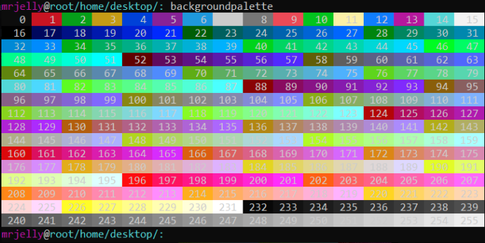

cd


This command will simply change the directory in which the user is in. The user can move up more than one directory so long as the directory exists.


Implementation: For cd we have similar structure to how Linux handles the changing of directory. If the user simply just put “cd” then it will put them in the root directory. If the User were to input “cd ..” then this will send the User to the parent directory.


clear


This command will simply clear the screen of all the previous commands and outputs. This will basically clear the buffer in which is keeping the outputs of the previous successful

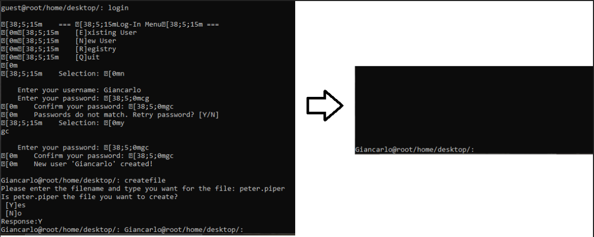

concat


This command will allow the user to combine one or more files so long as the files are of the same type.


Implementation: While this file joins two or more files, it will only add the final result to the first file given. While keeping the integrity of the other files. If the file types do not match then an error message will be given to the User.


copy


This command will allow the user to copy a certain file into a different directory.


Implementation: The use of this command is pretty straightforward as well. Only caveats are that there will be an error issued when the User tries to copy a file that doesn’t exist or to a directory that doesn’t exist either. Later we will implement features to where if the file or directory doesn’t exist then they will both be created, but will do so after the User is prompted if they want that to happen. Also will give a prompt to the User in regards to if they are trying to make a copy to a directory in which the file already exists there. The prompt will then ask if they want to overwrite the existing version or to cancel the process.


createdir


This command will create a new subsection directory within the directory in which the user is in.


Implementation: As stated this will create a sub-directory in the current directory or in the path given as a parameter. Error messages will be given to the User if they are trying to create a directory to a location not permitted, or if they are trying to create a directory that already exists in that path.


createfile


This will create a new file. By default it will be a .txt file if the type of the file isn’t stated.


Implementation: There will be a verification question asking the user to make sure they want to create the file. Also, if the file trying to be created already exists, then the User will be prompted if they want to overwrite the current file or cancel the entire process all together.

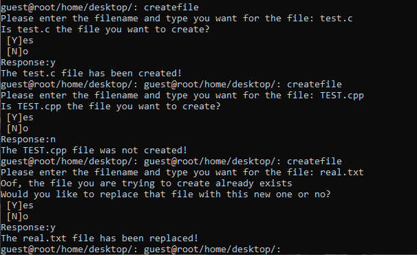

currentdir


This command will show which directory the user is currently in.


Implementation: This command is very helpful for maneuvering through the directories of the OS. If the User does get lost then they will be able to see the contents in the directory and also which one they are currently in. The example below is what a user would see when inputting the ‘currendir’ command. For the beginning version of PegasOS, we probably won’t include the amount of bytes in total there are in the current directory.

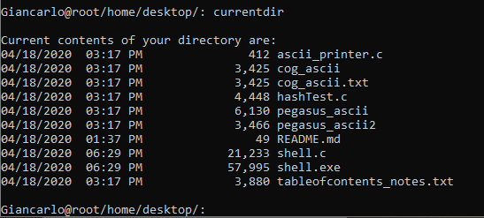

delete


This command will delete the file given as the parameter.


Implementation:There will be a verification question asking the user to make sure they want to delete the file.

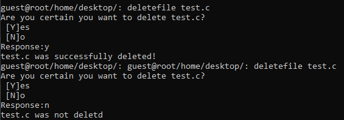

deletedir


This command will simply delete a directory passed through as a parameter.


Implementation: Like described above, this command will simply delete a directory. If the target directory does not exist then an error message will be displayed to the User. Also during the process of deleting the directory, the User will be prompted to verify if they want to continue with deleting it. This is done to help the User to make sure they are deleting the right directory in case they put the wrong path in the input.


echo


This will simply print out to the screen the string given as a parameter.


Implementation:Very basic and simple command, but was added for the User to see whether they are inputting commands correctly. Also, it's a common command across different operating systems so it is only fitting that we include this one.


filespace


This command will allow the user to see the remaining disk space for the Pi (SD card).


Implementation: This command is very helpful since it will allow the User to see the current available space that can be used. I can also show all the downloaded contents that are in the disk space and their file size.


find


This command will display in which sub-directory the file is, given by the parameter.


Implementation: This command will give an error message if the User is trying to find a file that does not exist.


head


This command will allow the user to see the first few lines of the file given file from the parameter.


Implementation: While the overall usage of this command is pretty straight forward,we are adding a little kick to it. The user will have the capability to add another parameter after giving the filename in which it will be an integer value that can be {1-(length of file)}. This parameter will be used to select n number of lines to be displayed to the screen. A warning will be given when the parameter given has exceeded the length of the file, but it will display the entire contents of the file in the end.

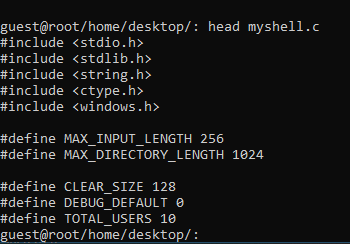

hello

This command is pretty straight forward for inputting this command simply prints to the screen “Hello there, guest! Welcome to PegasOS!”. As one can see, it has guest as the default but upon logging in it will put the user’s name there.


login


This command will allow the User to login into their account in the OS or create a new account if they have no account. Once logged in, the User will then be prompted.


Implementation: This command was discussed in full detail in the “User Subsystem” section in which operations can be done and to what extent the User can do. As stated above, this command is one of the most important ones in the matter that it allows the User to login or create an account and then in turn be granted certain permissions to do a variety of operations.


mount


This command will mount any I/O in the Pi to verify the connection is good for reads and writes.


Implementation:Overall this command is quite important for the aspect that it will verify that our drivers are working to the specification needed to maximize the reads and writes to devices.


move


This command will move a certain file from one directory to another.


Implementation: This command is pretty straightforward in its use, there is some clarification needed. Like described above this command will simply move an existing file into the designated destination of choice. There will be an error given to the User if they are trying to move a file that doesn’t exist. Later we may implement the choice of creating that new file if none exist. Also there will be an error message given if the path they are trying to move the file to doesn't exist.

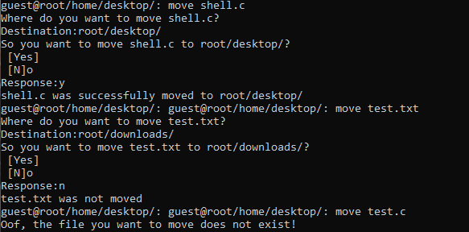

power


This command will enable the user to simply power off the Pi.


Implementation: Even though the most optimal way to power off the Pi is by simply disconnecting it from its power source, we believe by having an integrated power off command it will help negate any chances of errors when powering off by the plug.


systeminfo


This command will for the time being will display to the user all the usable memory, certain downloads, and version number.


Implementation: This command works kinda similar to TaskList and FileSpace where this command will display to the User the amount of available memory(RAM), the downloads that have been done since the last time being powered off, and the version number for PegasOS. There will be other features to be added in the future once more components are added to the OS. In later versions, this will be helpful in terms that it will display to the User if they are on the latest version of the OS.


tail


This command will display the last few contents of a given file.


Implementation:This command will be very similar to that of Head. There will be an extra feature to Tail in that the User will be able to input an extra parameter which will be an integer value. This integer value will be used to grab n number of lines starting from the end of the file. The integer will be verified that it is between {1-(length of the file)}. If the integer given is greater than the file length then a warning will be given to the user yet it will display all the contents of the file. An error message will be given if the User inputs a value less than 1.

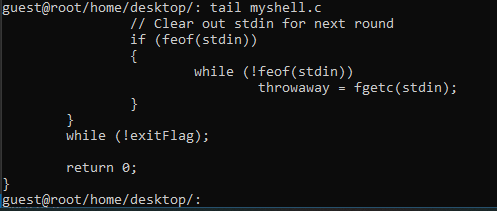

tasklist


This command will display all the running tasks, their PID, and their memory consumption.


Implementation: This command is quite important since we will be running a CLI compared to a GUI for PegasOS. Like described briefly above this will display all the running programs and executables in the background. The need for this is for when a certain program isn’t responding anymore as planned then there is the need to terminate it via PID or name. Another use for this command is to see the amount of memory that is being used per program. SInce the Pi is only running on 2-4GB of RAM it is imperative that we conserve the amount each program uses.


terminatetask

This command will simply end the task via PID given as a parameter. This command works in conjunction with Tasklist since the user will need the PID from there for the parameter.

Implementation: This command works in conjunction with TaskList since we need to find the name and PID for which the program needs to be terminated. Once caling this program with the corresponding PID/Name there will be a prompt asking if the User is sure about ending the program. A success message will be given when the program has been successfully terminated.

textpalette

This command prints out all of the available colors for text in the shell terminal.


uninstall

: This command will allow the user to delete any downloaded stuff to the Disk Space.

Implementation: This command is pretty important for the reasons that PegasOS is at the moment CLI based.  The command does what the name entails, it simply uninstalls any downloaded content to the User’s PC so long as the contents aren’t key components to the OS.

These commands were selected for the final cut for the initial design for the necessity for maneuvering through PegasOS and being able to use the Pi to its fullest potential. There will be more added after later versions of this Operating system when more applications are able to be done by the Pi. Also since the Pi keeps getting updates and newer versions, there will be more updates for PegasOS as well.

# 7.3 Basic Shell Architecture

Here we have the overall layout in which a shell will take in input(s) from the user and in which will then be parsed and bundled up with other executables, and once that is finished it is sent to the Program Execution cycle in the Kernel.


## 7.3.1 Lexical Analysis

The Lexer will simply take in a input stream from some source ie. the user or some program and then will break up the input into a sequence of tokens. The lexer will look at each character and classify them to some token or a group of characters which will be a lexeme and then assign that lexeme its token. Such a token can be “add” for ‘+’ or “print” for ‘printf’ about C. A token is an object for which it represents the lexeme it was mapped to and these tokens can in turn have their classification: Number, Identifier, or Operator. Some tokens can have other attributes such as which row and column in which the token was seen in the code.

The method in which the lexer can recognize the tokens from the input stream is by running based on some sort of predefined grammar. A lexical grammar is simply the rules in which a group of characters can be categorized and have more distinct character cases. One example, the “identifier” token can be represented by `(letter | _) (letter| digit| _)*` So for the identifier token it is expecting a letter first followed by more characters or numbers until it sees a space which ends that instance for the token.If the lexer doesn't get the following characters to fulfill the following regular expression, then it will give an error message.

A regular expression is the small component of a grammar that holds the rules for one set of token aspects. Like a “Letter” regular expression can be in the form of [a-z,A-Z]. The overlying main concept for this to work is thanks to a concept of finite state automata/machines. These finite state machines are a graph/ control flow for characters to be interpreted by the lexer. It will have a set starting state where the first character would “enter” and then would continue along the path of accepting states so long as the next coming character is valid in the state machine. The characters will continue to flow in and make their way through the accepting states until they hit the terminating state which will give a success to the lexer and then create the token. If the current string never hits the terminating state then it will terminate it on its own and issue an error.When all of the input from the stream has been lexed and then tokenized it will be sent to the parser for further inspection.

## 7.3.2 Parser

The Parser works very closely to the Lexer but not enough to be the same component overall. While the Lexer simply took the input stream and created tokens representing all the characters/strings read in, the job of the Parser is to look at each token and make sure they follow the Grammar set so that the token makes a working error-free program. The overall concept for the Parser is that it reads a token and it will verify that the following tokens are valid and fit for the current section of the Grammar. The following Grammar representation below is something similar to what grammar we will be following when Parsing the incoming inputs.

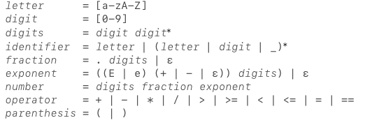

One thing to clarify and explain is the idea and usage of a Grammar and how it is represented. The image above this represents a very similar grammar that was used in the Lexer to create the tokens. The only difference is that we only used a fraction of the presented grammar since all we are looking for are the commands and the files and other associated parameters for that given command. So in cases where we read in the tail command, we would be expecting a file as a parameter rather than say a path to a directory.

## 7.3.3 Shell Architecture for PegasOS

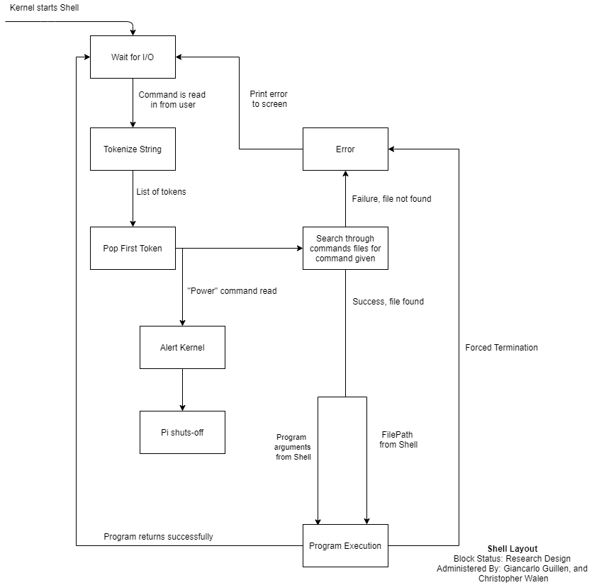

Once all the booting has been completed and the kernel has done the system check, the kernel will then call the shell to be executed. The shell will be running until the user inputs a command with parameters if needed. Once the input has been read in it will be sent to be tokenized via Lexer/Parser. It will tokenize the command and then the following parameters for the given command. Once the tokenizing has been completed, we add them to a stack or queue like data structure and pop the first token which is the command token.

We first compare it to the command keyword “Power” and if the token matches the keyword it will then send an alert to the Kernel which will then shut the Pi off. The other case is that the keyword isn't the same then we send the token to be compared to the command file names in our directory. If there is a file that matches our command, then we progress to send the parameters and the file path to the ProgramExecution Block which will be bundled up and sent to the Scheduler to be executed by the CPU. If a file cannot be found for the command given or it fails when the CPU tries to execute the command then it will display an error to the screen and then wait for another input from the user. The same happens when the CPU runs the command and is successful in doing so since it will display the result to the screen and then wait for the next input from the user.

## 7.3.4 Process Flow


Here we have the Process Flow block diagram that will come from the Shell execution path and will then enter the ProgramExecution once we find the associated command file for the command entered through by the user. From here we send those components to the “Bundle into ProcessBlock” block. In this block, we create a struct that will contain the command file, the parameters, the pc clock in which the CPU will return to once completed, and other necessary information for which the CPU will need for execution. Once all this is complete we send it to the scheduler which will do its job and send it to the CPU to be executed. It will continue to send it to the CPU until it completes it and once the task is done it will send back either a success or failure to the user.

## 7.3.5 Process Flow for Shell

Before going into full detail of how the shell will be operated and completed, there is one step that will be explained first. In the Linux operating system, the format in which each command is done is quite unique and actually intuitive for its purpose. When a user inputs a command and its parameters, the shell of Linux takes that command inputted and then goes into a sub-directory folder where the shell file is and looks for a file that matches the command given. Once the file has been found, it then sends the parameters given by the user as inputs for the matched file.

The reason for explaining this is the fact that we are using this format for executing each and every command that a user can use in PegasOS. The main reason we wanted to implement this is that it will allow for easier updates for the OS when adding new commands since the shell should work for every command once launched. Of course, there would be instances that we will need to change things in the main shell file.

Once the kernel has completed all the systems checks for each component and every driver, the kernel will then launch the shell to start to run. The program file running the shell will begin, first it will create all the structs and macro variables needed to perform all the necessary actions. Such macro variables will be:

```
#define INPUT_BUFFER_SIZE=256;

#define PAST_COMMANDS_BUFFER=100;
```

The macro variable INPUT_BUFFER_SIZE has the value 256 for it holds the input string that the User inputted for a command to be completed. The value of 256 is used for the length of the char array. We used 256 for it is the standard length for input strings.

The macro variable PAST_COMMANDS_BUFFER is used to set the max length for the Struct List which is a Linked list. This list is used to hold all the previously inputted commands the User has done.

Structs that will be needed are:

```
Typedef struct token{

        Char input [INPUT_BUFFER_SIZE];

        Struct Token *parent;

        Struct Token* next;

} Token;


Typedef struct List{

        Token* head;

        Token* tail;

} List;
```

The usage of the struct Token is very important. The struct itself holds a character array of length 256 and a pointer to another Token called next. The character array simply holds the inputted string from the User. We hold the entirety of the string here and then later “tokenize” the string so we are able to separate the commands and the parameters. The pointer to the Token called Next will simply point to the next token in line, in this case, it would point to the token that is created after it. The pointer to the Token called parent is very important for being able to traverse back up the list.

The main reason we needed to add this component to the struct is that when the User is scrolling back up to view the previous inputted commands it would be easier and more time-efficient for the child node to be able to “look” back up to the parent pointer. Like mentioned, having this pointer is way more time-efficient since we would only have to do one line of code, while if we didn't have that pointer we would have to go to the head of the list and then traverse down till we find the parent Token. Doing that would be completely time inefficient since the length of the List could be arbitrarily long at some instances which would then slow down the usage of the OS when simply doing a simple scroll up operation.

The usage of the struct List is pretty straightforward. It has the same structure of a linked list that has a pointer to the beginning of the list, head, and also a pointer to the end of the list, tail. The majority of the time we will be inserting token pointers to the end of the list so that way they are in order from first to last. Having a tail token pointer is very useful because it will make the insertion to the tail a lot easier and faster since we won't have to start from the head and traverse our way to the end. The head Token pointer is needed for instances in which we need to maneuver through the list from the beginning.

Once these essential variables and structs have been defined, we move on to defining vital functions that will be needed to do certain operations to prep the incoming strings that will be sent off to a different file to which matches the corresponding command given by the User. As described earlier through the Shell Layout Diagram, if the shell program is unable to find any corresponding file that matches the command given, then an error message will be displayed to the User thus asking them to enter their previous input but to put the correct command.

Such functions that we’ll be using in the main shell program are:

```
int getCommand();

void sendToCommandFile();

void scroll();

List* createList();

Token* createToken();
```

For the function, getCommand(), will take a Pointer to a token and return an integer value. Once entering the function, we will copy the character array to a local array in the function to keep the integrity of the original array so no changes can be made to it by mistake. Once copied successfully, we will run through a giant string compare if-else statements to find a matching if statement to the command found in the array. Once an equivalent string compare was found, we enter the corresponding if statement which will then return a certain integer which will correspond to that command. If no string compare equivalent is found, then the function will default and return a 0.

The following table will show all the corresponding integer return values to each of their commands:

| Command Name      | Integer Value |
| ----------------- | ------------- |
| backgroundpalette | 1             |
| cd                | 2             |
| clear             | 3             |
| concat            | 4             |
| copy              | 5             |
| createdir         | 6             |
| createfile        | 7             |
| currentdir        | 8             |
| delete            | 9             |
| deletedir         | 10            |
| echo              | 11            |
| filespace         | 12            |
| find              | 13            |
| head              | 14            |
| login             | 15            |
| mount             | 16            |
| move              | 17            |
| power             | 18            |
| textpalette       | 19            |
| systeminfo        | 20            |
| tail              | 21            |
| tasklist          | 22            |
| terminatetask     | 23            |
| uninstall         | 24            |

For the function sendToCommandFile(), we will take a pointer to a Token and an integer value. The integer value should be equal to the corresponding command value set though the getCommand function. Once entering the function, it filters through the character array so that way it can separate the parameters from the command name and then store it in a local character array, and then it is taken straight into a giant switch statement which will be comparing the integer value passed as a parameter. When the appropriate integer is found, it is taken into its case statement. In the case statement, it will be sent off with the character array to where the process flow will find the corresponding file for the command.

For the function createList(), it will simply allocate memory and create a new Linked List with both the head and tail Token pointers set to NULL. Once that is done, it will return the address to the newly created Linked List.

For the function createToken(), it will simply allocate memory and create a new Token will the character array, and both Token pointers set to NULL. Once that is done, it will return the address to the newly created Token.

Once all of these functions are set and defined, we enter the int main() function. In this, we will create variables and structs then enter a while loop that will only ever end when either the power is turned off or the command power is given by the User. In the loop, the previously mentioned algorithm will be running by getting input from the User and then sending it off to the corresponding command name file.

# 7.4 Shell Interactions with Kernel

The way the Shell interacts with the Kernel is mostly through system calls and software interrupts that have been clarified previously in the System Calls section in this document. In this case, the system calls will be the majority of the commands stored in the file that each command represents. There will be calls to check if certain files, directories, or drivers, etc. are present before the rest of the code in the file can execute.

Due to the nature of how closely the Shell is working to the Kernel, it is essentially a component of the Kernel. The number of system calls and kernel subsystems that the Shell must interact with means that it must be developed alongside the Kernel’s development, as the Shell is doubling as our interface and as a user-operated extension of Program Execution. A primary concern is the communication between the completion or termination of a process and the resulting error or termination codes and the passing of control back to the Shell. This can be more easily solved if Shell is a component of the Kernel with direct connections to the Scheduler and Program Execution.

[Back - Kernel](6_KERNEL.md) | [Next - Administrative Content](8_ADMINISTRATIVE_CONTENT.md) | 
[Design Document Home](DESIGN_DOCUMENT.md) | [Documentation Home](../README.md)